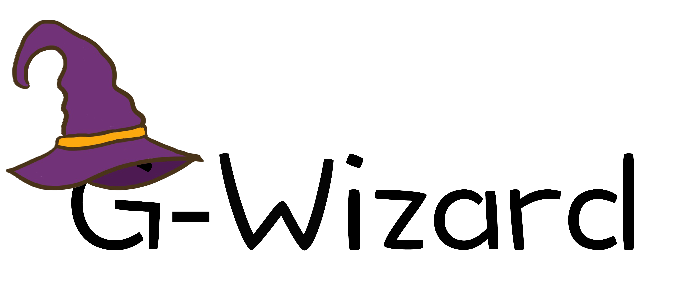

# GPUMD-Wizard
Material structure processing software based on [ASE](https://wiki.fysik.dtu.dk/ase/index.html) (Atomic Simulation Environment) providing automation capabilities for calculating various properties of metals. Additionally, it aims to run and analyze molecular dynamics (MD) simulations using [GPUMD](https://github.com/brucefan1983/GPUMD).

## Features
* Based on the ASE package, MetalProperties-Automator supports different calculators such as [calorine](https://calorine.materialsmodeling.org/installation.html#installation-via-pip), [DP](https://github.com/deepmodeling/deepmd-kit), and [LAMMPS](https://www.lammps.org/).
* Allows for automated batch calculations of metal properties.
* Enables batch processing of files in the XYZ format.
* Integrated with [GPUMD](https://github.com/brucefan1983/GPUMD) for performing molecular dynamics simulations, such as irradiation damage.

## Installation


### Requirements


|  Package  | version |
|  ----  | ----  |
| [Python](https://www.python.org/) | >=     3.8 |
| [ase](https://wiki.fysik.dtu.dk/ase/index.html)|>=     3.18.0|
| [calorine](https://gitlab.com/materials-modeling/calorine)|>=     2.2.1|
| [phonopy](http://phonopy.github.io/phonopy/)|>=     v2.22.0|


 ### From Source

```shell
$ git clone --recursive https://github.com/Jonsnow-willow/GPUMD-Wizard.git
```

Add `GPUMD-Wizard` to your [`PYTHONPATH`](https://wiki.fysik.dtu.dk/ase/install.html#envvar-PYTHONPATH) environment variable in your `~/.bashrc` file.

```shell
$ export PYTHONPATH=<path-to-GPUMD-Wizard-package>:$PYTHONPATH
```

## Usage
```python
from wizard.atoms import SymbolInfo, MaterialCalculator
from calorine.calculators import CPUNEP

def main():
    # Create calculator object 
    calc = CPUNEP('nep.txt')
    
    # Set properties-related parameters
    millers = [(1,1,0),(0,0,1),(1,1,1),(1,1,2)]
    sia_vectors = [(1/2,1/2,1/2),(1,0,0),(1,1,0)]
    nths = [1,2,3]

    # Generate bulk atoms and calculate properties
    symbol_info = SymbolInfo('W', 'bcc', 3.185)    
    atoms = symbol_info.create_bulk_atoms()
    material_calculator = MaterialCalculator(atoms, calc, symbol_info.symbol, symbol_info.structure)
    material_calculator.lattice_constant()
    material_calculator.elastic_constant()
    material_calculator.eos_curve()
    material_calculator.phonon_dispersion()
    material_calculator.formation_energy_vacancy()
    material_calculator.migration_energy_vacancy()
    for nth in nths:
        material_calculator.formation_energy_divacancies(nth)
    for miller in millers:
        material_calculator.formation_energy_surface(miller)
    material_calculator.stacking_fault(a = (1,1,-1), b = (1,-1,0), miller = [1,1,2], distance = 3.185/2)
    material_calculator.stacking_fault(a = (1,1,-1), b = (1,1,2), miller = [1,-1,0], distance = 3.185/2)
    material_calculator.pure_bcc_metal_screw_dipole_move()
    material_calculator.pure_bcc_metal_screw_one_move()
    for vector in sia_vectors:
        material_calculator.formation_energy_sia(vector)
    material_calculator.formation_energy_interstitial_atom('W',[0,0,1/2],'octahedral')
    material_calculator.formation_energy_interstitial_atom('W',[1/4,0,1/2],'tetrahedral')

if __name__ == "__main__":
    main()
```

## Citations

| Reference             | cite for what?                    |
| --------------------- | --------------------------------- |
| [1-2]                 | for any work that used `GPUMD`   |
| [3]                   | NEP + ZBL |
| [4]                   | UNEP |

## References

[1] Zheyong Fan, Wei Chen, Ville Vierimaa, and Ari Harju. [Efficient molecular dynamics simulations with many-body potentials on graphics processing units](https://doi.org/10.1016/j.cpc.2017.05.003), Computer Physics Communications **218**, 10 (2017). 

[2] Zheyong Fan, Yanzhou Wang, Penghua Ying, Keke Song, Junjie Wang, Yong Wang, Zezhu Zeng, Ke Xu, Eric Lindgren, J. Magnus Rahm, Alexander J. Gabourie, Jiahui Liu, Haikuan Dong, Jianyang Wu, Yue Chen, Zheng Zhong, Jian Sun, Paul Erhart, Yanjing Su, Tapio Ala-Nissila,
[GPUMD: A package for constructing accurate machine-learned potentials and performing highly efficient atomistic simulations](https://doi.org/10.1063/5.0106617), The Journal of Chemical Physics **157**, 114801 (2022).

[3] Jiahui Liu, Jesper Byggmästar, Zheyong Fan, Ping Qian, and Yanjing Su,
[Large-scale machine-learning molecular dynamics simulation of primary radiation damage in tungsten](https://doi.org/10.1103/PhysRevB.108.054312),
Phys. Rev. B **108**, 054312 (2023).

[4] Keke Song, Rui Zhao, Jiahui Liu, Yanzhou Wang, Eric Lindgren, Yong Wang, Shunda Chen, Ke Xu, Ting Liang, Penghua Ying, Nan Xu, Zhiqiang Zhao, Jiuyang Shi, Junjie Wang, Shuang Lyu, Zezhu Zeng, Shirong Liang, Haikuan Dong, Ligang Sun, Yue Chen, Zhuhua Zhang, Wanlin Guo, Ping Qian, Jian Sun, Paul Erhart, Tapio Ala-Nissila, Yanjing Su, Zheyong Fan,
[General-purpose machine-learned potential for 16 elemental metals and their alloys](https://doi.org/10.48550/arXiv.2311.04732)
arXiv:2311.04732 [cond-mat.mtrl-sci]