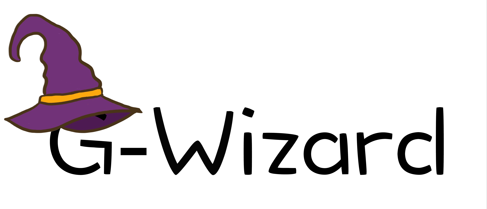

# GPUMD-Wizard
GPUMD-Wizard provides Python workflows for atomistic structure preparation, material-property evaluation, and simulation setup. It uses [ASE](https://wiki.fysik.dtu.dk/ase/index.html) (Atomic Simulation Environment) objects and calculators to connect alloy and defect structures with property calculations, extended-XYZ datasets, and [GPUMD](https://github.com/brucefan1983/GPUMD) runs.

## Features
* Construct and perturb bulk, alloy, and defect structures using ASE objects.
* Evaluate material properties with ASE-compatible calculators, including equations of state, elastic constants, phonons, surfaces, and defects.
* Process extended-XYZ datasets and select candidate configurations for external potential-training workflows.
* Prepare GPUMD input files and run simulations, including irradiation workflows.
* Perform calculator-driven molecular dynamics and hybrid molecular-dynamics/Monte-Carlo sampling.

## Tutorials

* [Material-property calculations](tutorials/Calculatiing_Material_Properties): worked scripts and selected outputs for EAM and NEP potentials.
* [Structure and dataset generation](tutorials/Generate_Train_set): bulk alloys, perturbations, vacancies, and interstitial configurations.
* [GPUMD workflows](tutorials/Molecular_Dynamics): relaxation, deformation, deposition, crystallization, and irradiation examples.
* [Data-processing tools](tutorials/tools): scripts for preparing and inspecting external calculation data.

## Installation

Python 3.10 or newer is required. Install the current source from the
`main` branch in a virtual environment:

```bash
git clone --branch main https://github.com/Jonsnow-willow/GPUMD-Wizard.git
cd GPUMD-Wizard
python3 -m venv .venv
source .venv/bin/activate
python -m pip install .
```

On Windows, activate with `.venv\Scripts\activate` instead. Python dependencies
(ASE, NumPy, calorine, phonopy, spglib and Matplotlib) are installed automatically;
their version requirements are recorded in [pyproject.toml](pyproject.toml).

GPUMD execution requires a separately installed [GPUMD executable](https://gpumd.org/).
LAMMPS-based tutorials require LAMMPS with its Python interface. These external
programs are not needed for the quick example.
NEP calculations additionally require a suitable potential file.

## Quick example

This four-atom Cu example uses ASE's built-in EMT calculator on a CPU. Run it in a
scratch directory: property methods append results to `MaterialProperties.out`
and `MaterialProperties.xyz` in the current working directory.

```python
from ase.calculators.emt import EMT
from wizard.structure.atoms import AlloyInfo
from wizard.calc.calculator import MaterialCalculator

atoms = AlloyInfo("Cu", "fcc", 3.61).create_bulk_atoms((1, 1, 1))
properties = MaterialCalculator(atoms, EMT(), clamped=True)
print("\n".join(properties.lattice_constant()))
```

With `clamped=True`, the reported lattice constants remain 3.6100 Å and the
volume is 11.761 ų/atom. Omit it to relax the structure before evaluation.

## Authors:

| Name                  | contact                           |
| --------------------- | --------------------------------- |
| Jiahui Liu            | liujiahui@zgci.ac.cn              |

## Citations

| Reference             | cite for what?                    |
| --------------------- | --------------------------------- |
| [1]                   | NEP + ZBL |
| [2]                   | UNEP |
| [3]                   | MoNbTaVW |
| [4]                   | for any work that used `GPUMD`    |

## References

[1] Jiahui Liu, Jesper Byggmästar, Zheyong Fan, Ping Qian, and Yanjing Su,
[Large-scale machine-learning molecular dynamics simulation of primary radiation damage in tungsten](https://doi.org/10.1103/PhysRevB.108.054312),
Phys. Rev. B **108**, 054312 (2023).

[2] Keke Song, Rui Zhao, Jiahui Liu, Yanzhou Wang, Eric Lindgren, Yong Wang, Shunda Chen, Ke Xu, Ting Liang, Penghua Ying, Nan Xu, Zhiqiang Zhao, Jiuyang Shi, Junjie Wang, Shuang Lyu, Zezhu Zeng, Shirong Liang, Haikuan Dong, Ligang Sun, Yue Chen, Zhuhua Zhang, Wanlin Guo, Ping Qian, Jian Sun, Paul Erhart, Tapio Ala-Nissila, Yanjing Su, Zheyong Fan,
[General-purpose machine-learned potential for 16 elemental metals and their alloys](https://doi.org/10.1038/s41467-024-54554-x),
Nature Communications **15**, 10208 (2024).

[3] Jiahui Liu, Jesper Byggmästar, Zheyong Fan, Bing Bai, Ping Qian, and Yanjing Su,
[Utilizing a machine-learned potential to explore enhanced radiation tolerance in the MoNbTaVW high-entropy alloy](https://www.sciencedirect.com/science/article/pii/S0022311525003988),
Journal of Nuclear Materials, 156004 (2025).

[4] Ke Xu, Hekai Bu, Shuning Pan, Eric Lindgren, Yongchao Wu, Yong Wang, Jiahui Liu, Keke Song, Bin Xu, Yifan Li, Tobias Hainer, Lucas Svensson, Julia Wiktor, Rui Zhao, Hongfu Huang, Cheng Qian, Shuo Zhang, Zezhu Zeng, Bohan Zhang, Benrui Tang, Yang Xiao, Zihan Yan, Jiuyang Shi, Zhixin Liang, Junjie Wang, Ting Liang, Shuo Cao, Yanzhou Wang, Penghua Ying, Nan Xu, Chengbing Chen, Yuwen Zhang, Zherui Chen, Xin Wu, Wenwu Jiang, Esme Berger, Yanlong Li, Shunda Chen, Alexander J. Gabourie, Haikuan Dong, Shiyun Xiong, Ning Wei, Yue Chen, Jianbin Xu, Feng Ding, Zhimei Sun, Tapio Ala-Nissila, Ari Harju, Jincheng Zheng, Pengfei Guan, Paul Erhart, Jian Sun, Wengen Ouyang, Yanjing Su, Zheyong Fan, [GPUMD 4.0: A high-performance molecular dynamics package for versatile materials simulations with machine-learned potentials]( https://doi.org/10.1002/mgea.70028), MGE Advances **3**, e70028 (2025).
